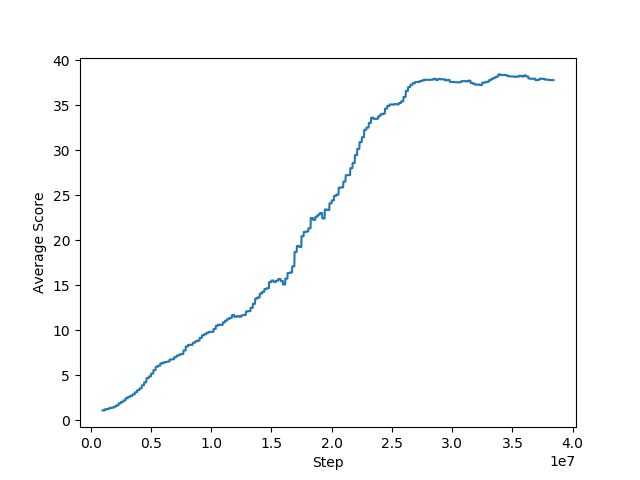

# Report 

## Summary 
The PPO (Proximal Policy Optimization) algorithm is used to train an agent to solve the environment.

The figure below illustrates the average score over the last 100 episodes obtained during training.

It is observed that, with the proposed network architecture and hyperparameters, the learning is stable. The environment is solved in approx. 1160 episodes and the final score converges to a maximum of 38.45.

## Network Architecture 

Actor and critic networks with continuous action space are used. The first two fully connected layers are common to both networks. Then, in the case of the critic, a fully connected layer yields the state value. For the actor, a fully connected layer gives the mean of a normal distribution for each action. The action to be taken is sampled from this mean and a learnable scalar standard deviation. Entropy is used to force exploration of the actor and is calculated from the normal distribution.

The algorithm can be summarized as follow:

1. Trajectory of 100 steps are sampled from all 20 parallel agents. 
2. The advantage at each timestep is calculated using [Generalized Advantage Estimate](https://arxiv.org/abs/1506.02438). 
3. Ten training epochs are performed over all accumulated trajectories and calculated advantages. Each time, the probability ratio is recalculated and clipped. Both the critic and the actor network are trained at the same time. 

## Hyperparameters

The hyperparameters used during training are:

Parameter | Value | Description
------------ | ------------- | -------------
Parallel Agents | 20 | Number of agents trained simultaneously
Iterations | 2000 | Number of iterations to run
Epochs | 10 | Number of training epoch per iteration
Batch size | 32*20 | Size of batch taken from the accumulated  trajectories
Timesteps | 100 | Number of steps per trajectory 
Gamma | 0.99 | Discount rate 
Ratio clip | 0.2 | Ratio used to clip r = new_probs/old_probs during training
Gradient clip | 10.0 | Maximum gradient norm 
Learning rate | 1e-4 | Learning rate 
Beta | 0.01 | Entropy coefficient 
Tau GAE | 0.95 |Generalized Advantage Estimate tau coefficient

## Further work 

- Use a deeper network.
- Use a fully connected layer to model the standard deviation of the actor (in the current implementation, the deviation is a scalar not function of the state).
- Use some form of curiosity to favorize exploration ([link](https://arxiv.org/abs/1808.04355)).